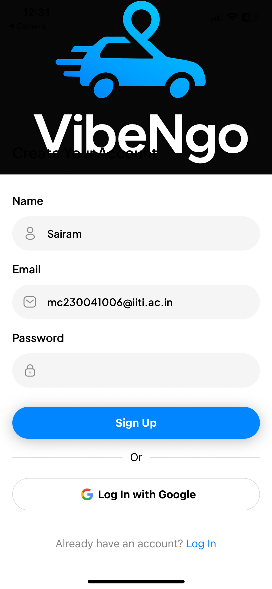
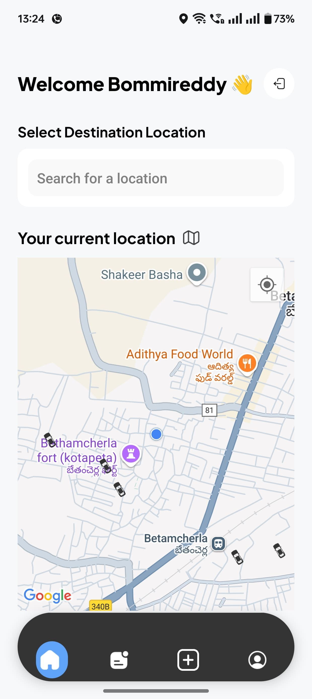
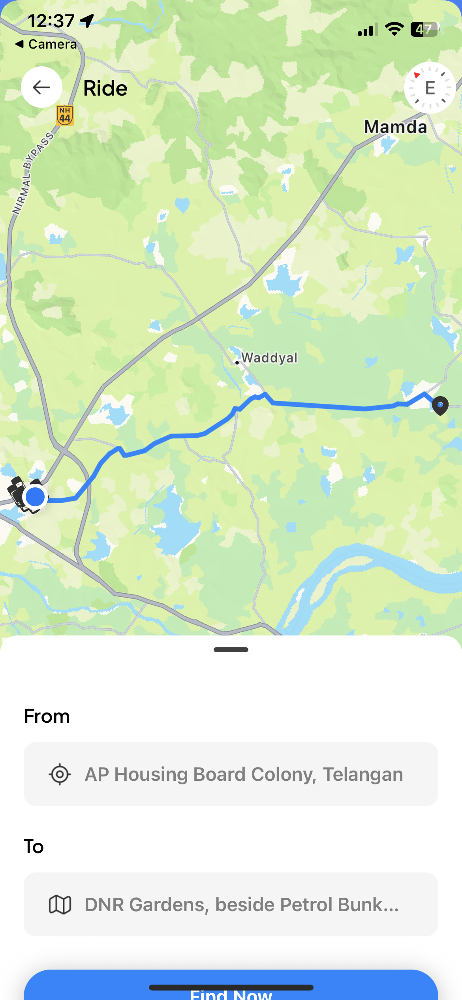
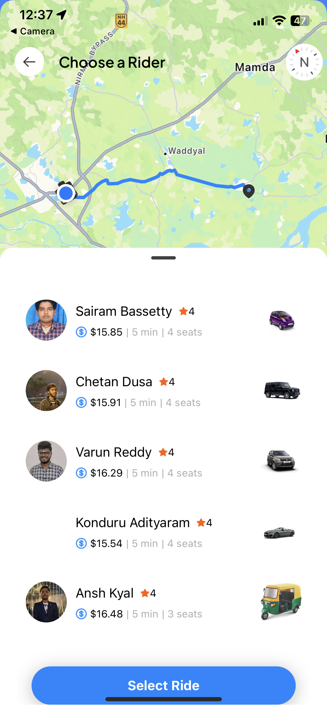
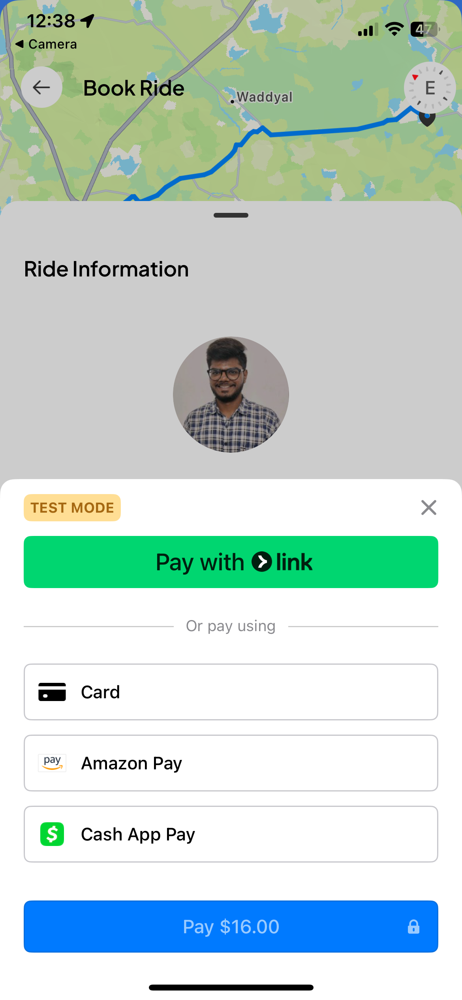
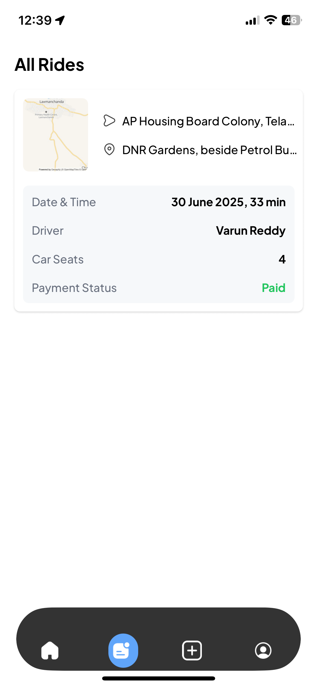
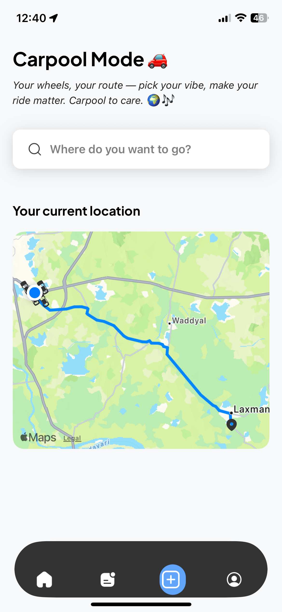
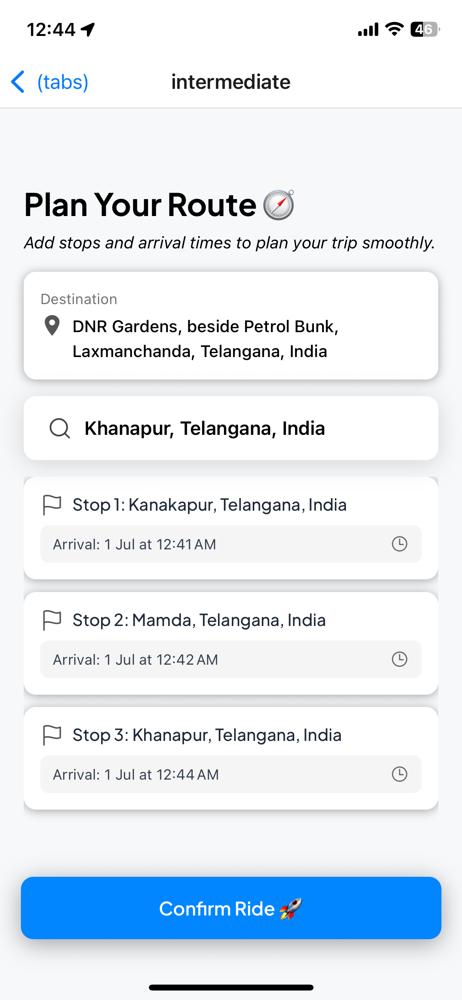
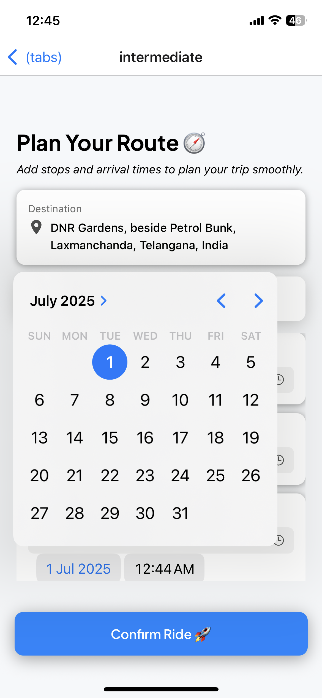

#  VibeNgo  
*Hybrid Ride Booking App with Real-Time Carpool Integration*
 
### 🔗 Live Demo

 **Install our app **  
[Click here to install VibeNgo](https://expo.dev/accounts/bommireddy3132/projects/VibeNgo/builds/845f9f19-e516-4b88-9a41-02722b97a2b4)

---


### Contributors

- **Varun kumar reddy Bommireddy**  
- **Chetan**  
- **Sairam**  
> Developed under the guidance of **Dr. Subhra Mazumdar**, IIT Indore.

---

## Overview

**VibeNgo** is a full-stack, cross-platform mobile application for seamless cab bookings with intelligent real-time carpool suggestions. Designed for affordability and sustainability, it connects users traveling in the same direction — reducing cost and carbon footprint.

---

## Features

-  **Cab Booking** with live status
-  **Real-Time Carpool Matching**
-  **Interactive Google Map Integration**
-  **Multi-Stop Ride Support**
-  **ETA Calculation at Each Stop**
-  Built using **React Native + Expo** for Android & iOS

---

##  Tech Stack

| Layer       | Technology                     |
|-------------|-------------------------------|
| Frontend    | React Native, TypeScript       |
| Styling     | Tailwind CSS via NativeWind    |
| Navigation  | Expo Router                    |
| Maps        | Google Maps API                |
| Auth        | Clerk                          |
| Payments    | Stripe                         |
| Backend     | Neon DB (PostgreSQL)           |
| State Mgmt  | Zustand                        |

---
```
##  Project Structure
VibeNgo/
├── assets/           # Images, logo, icons
├── components/       # UI Components (StopCard, RideCard, etc.)
├── screens/          # Screens (Home, BookRide, ConfirmRide, etc.)
├── navigation/       # Expo Router layouts
├── services/         # API handling and helpers
├── utils/            # Utility functions
├── App.tsx           # Entry point
└── README.md         # Documentation
```
---

##  Getting Started

###  Prerequisites

- Node.js ≥ 16  
- Git  
- Android/iOS device with **Expo Go App**  
- Install Expo CLI globally:

```bash
npm install -g expo-cli
# Clone the repository
git clone https://github.com/your-username/VibeNgo.git
cd VibeNgo

# Fix npm permissions (recommended)
sudo chown -R $(id -u):$(id -g) ~/.npm

# Install dependencies
npm install

# Install Expo if prompted
npm install expo

# Install Stripe dependencies
npm install @stripe/stripe-react-native

# Start app in tunnel mode
npx expo start --tunnel
```
 Roadmap
 Google & Apple Sign-in

 In-app Stripe Payments

 Ride History & User Analytics

 Smart ML-based Carpool Matching

 Deployment via Expo Hosting

##  Acknowledgments

Made with dedication and collaboration at **IIT Indore**  
Under the supervision of **Dr. Subhra Mazumdar**


##  Screenshots

<table>
  <tr>
    <td></td>
    <td></td>
     <td></td>
    <td></td>
  </tr>
  <tr>
    <td></td>
    <td></td>
    <td></td>
     <td></td>
  </tr>
  <tr>
    <td></td>
    <td></td>
    <td></td>
    <td></td>
    
  </tr>
</table>

---


